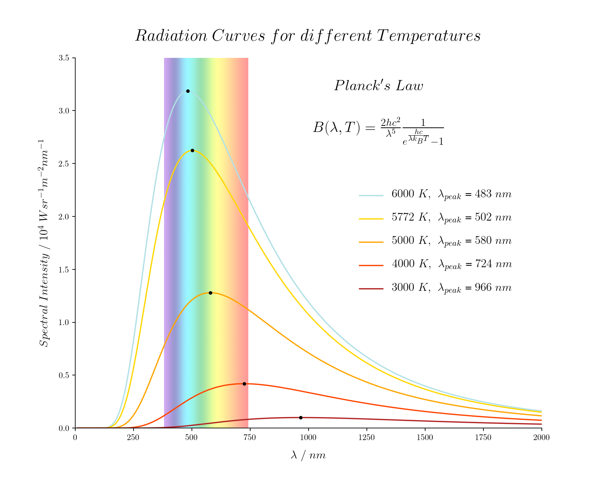

# Ηλιακή Ακτινοβολία

## Στόχος - Οπτικοποίησε την ακτινοβολία μέλανος σώματος για διαφορετικές θερμοκρασίες και υπολόγιστε την ενεργό θερμοκρασία για διάφορους πλανήτες

**Προβλέψτε**

Αναρωτηθείτε για τις παρακάτω ερωτήσεις και κάντε κάποιες προβλέψεις. Βεβαιωθείτε ότι έχετε πει σε κάποιον τι προβλέψατε!

1) Τα θερμότερα αντικείμενα εκπέμπουν μικρότερα ή μεγαλύτερα μήκη κύματος ;
2) Τι χρώμα είναι το χρώμα που εκπέμπεται περισσότερο από τον Ήλιο ;

## Εισαγωγή

Εισαγωγή στην ακτινοβολία μέλανος σώματος, και στους νόμους Wien και Stephan-Boltzman.

**radiationSun.py** είναι ο κύριος κώδικας

**blackbodyCurves.py** παράγει την παρακάτω εικόνα:

PS: να προσθέσουμε κάτι ; 
