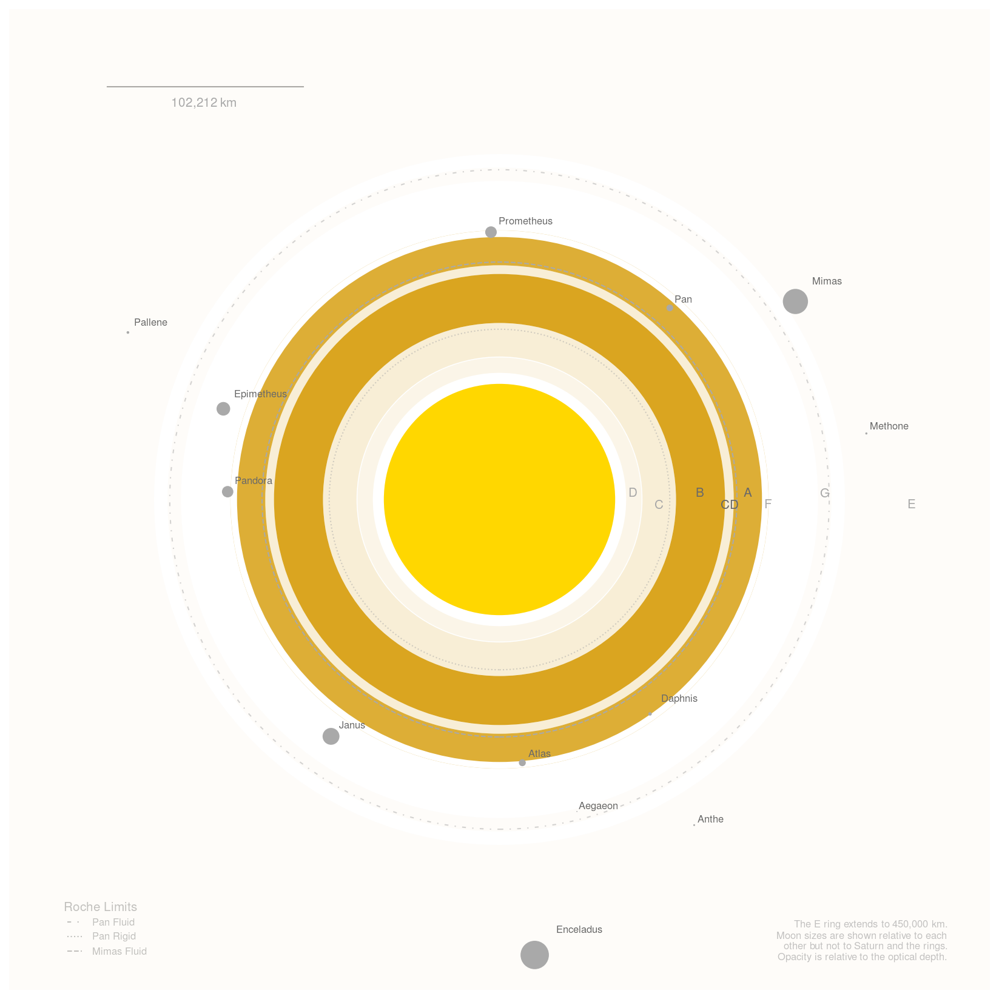
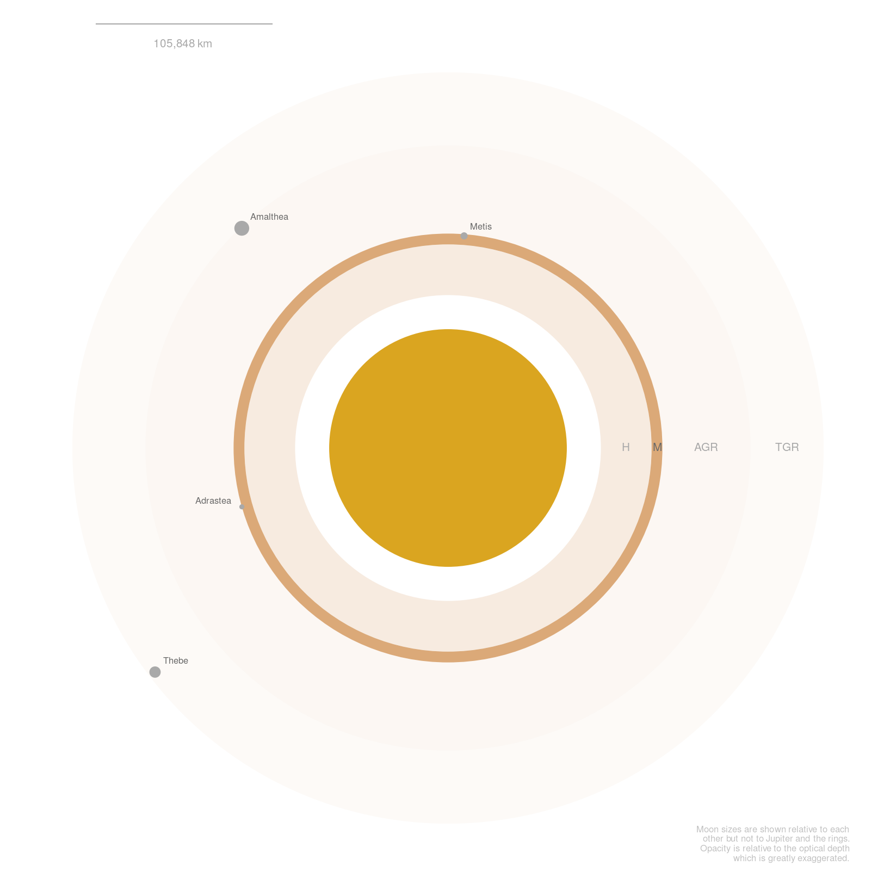
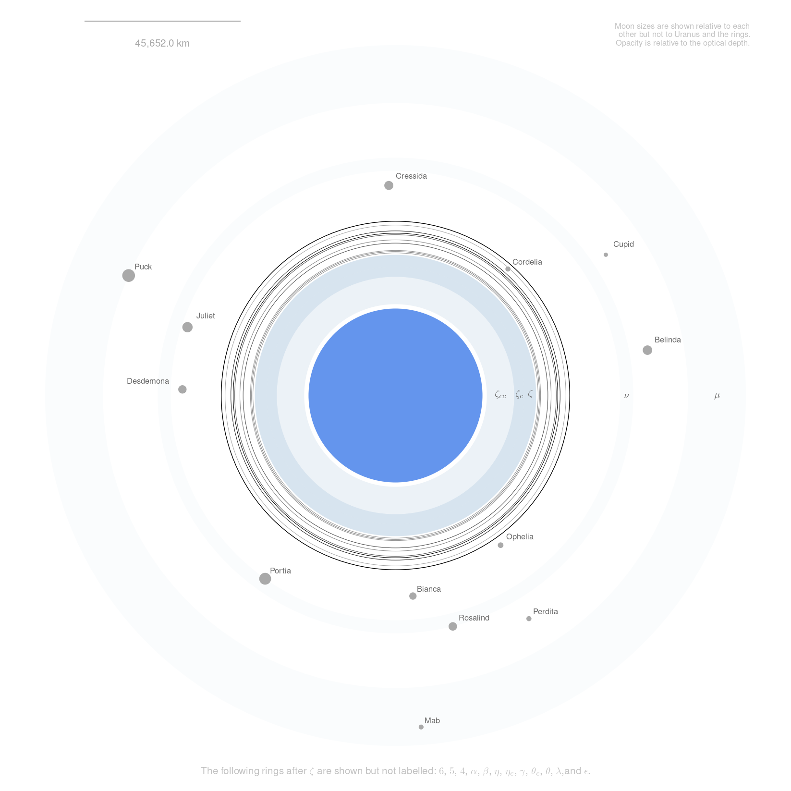
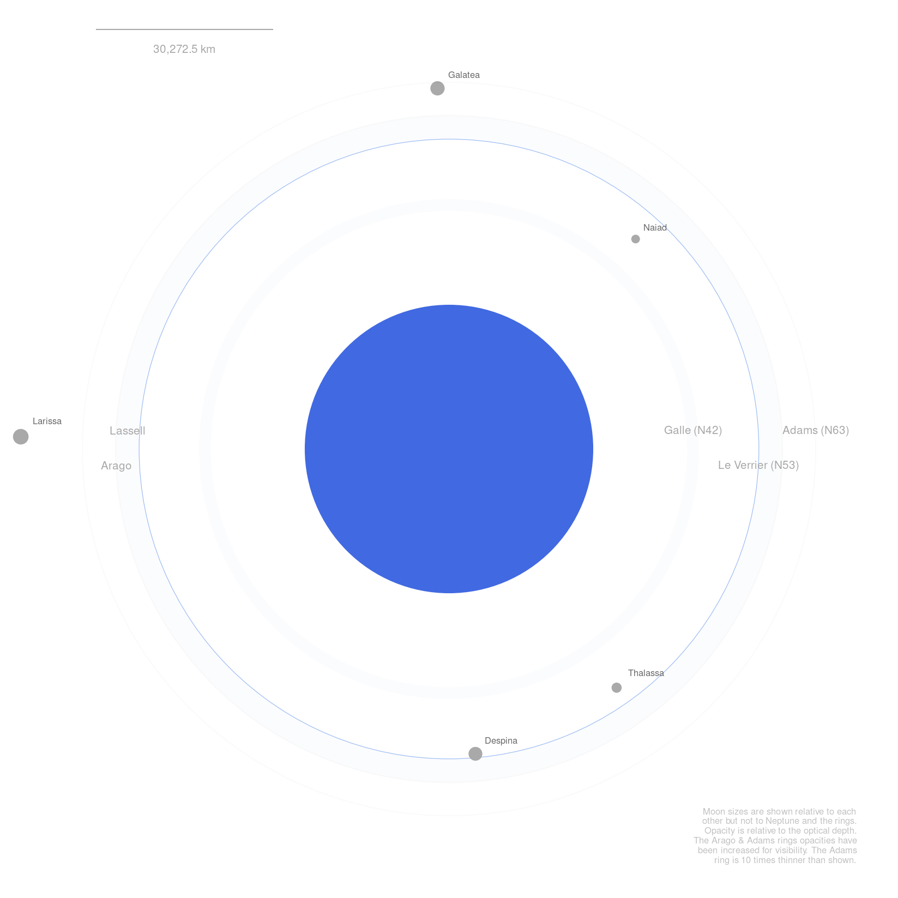

# Planetary Rings

## rings.ipynb
## AIM - Visualise the rings of Saturn and calculate the Roche limit of some moons.

**Predict**

Have a think about these questions and make some predictions! Be sure to tell someone else what you predict.

1) What are planetary rings made from?  
2) What happens if a satellite gets too close to its parent planet?  
3) Do all planets have rings?

## Intro

Visualise the rings of the gas giants (starting with Saturn).  
Calculate the roche limits for moons of Saturn.

**planetary_rings.py** makes my figure of Saturn's rings. The other **.py** files in the ***data*** directory make the ring figures for the other gas giants.

## Challenge

1) Make similar plots for the ring systems of Jupiter, Uranus, and Neptune.  
2) Identify other moons inside the Roche limit (rigid or fluid) for each gas giant.  
3) Scale the transparency of each ring so that a drop of alpha by .1 corresponds to an order of magnitude drop in od.  
## References

Roche Limit - [https://en.wikipedia.org/wiki/Roche_limit](https://en.wikipedia.org/wiki/Roche_limit)  
David Simpson, The Rings of Saturn - [https://caps.gsfc.nasa.gov/simpson/kingswood/rings/](https://caps.gsfc.nasa.gov/simpson/kingswood/rings/)  
C Porco et al. (2007) Saturn's Small Inner Satellites: Clues to Their Origins [http://ciclops.org/media/sp/2007/4691_10256_0.pdf](http://ciclops.org/media/sp/2007/4691_10256_0.pdf)  
Matthew Hedman, Planetary Ring Dynamics - [https://www.eolss.net/Sample-Chapters/C01/E6-119-55-13.pdf](https://www.eolss.net/Sample-Chapters/C01/E6-119-55-13.pdf)  
Sébastien Charnoz et al, Origin and Evolution of Saturn's Ring System - [Here](http://lasp.colorado.edu/~espoclass/ASTR_5835_Fall-2017-Review%20Chapters-Saturn/17-Origin%20and%20Evolution%20of%20Saturn%27s%20Ring%20System.pdf)

Data from:  
Ring-Moon Systems Node, SETI/NASA/JPL - [https://pds-rings.seti.org/](https://pds-rings.seti.org/)  

## Acknowledgements

Thanks to [Matthew M. Hedman](https://webpages.uidaho.edu/mhedman/) and [Larry Espocito](http://lasp.colorado.edu/~esposito/) for their help in locating data on planetary rings and satellites.

# Data Files

## planetary_rings.csv

Contains data on the rings of the gas giants from various sources.

The following data files are also present with the suffix **moons** indicating data on the inner moons/satellites of the planet and there is an extra file **saturn_rings.csv** with a more detailed structure for Saturn's rings. Most of this data is from the Ring-Moon Systems node of the Planetary Data System (PDS), see references above.

Each data source has it's own explanatory ***.txt*** file!

# Outputs

Saturn's rings

Jupiter's rings

Uranus's rings

Neptune's rings
