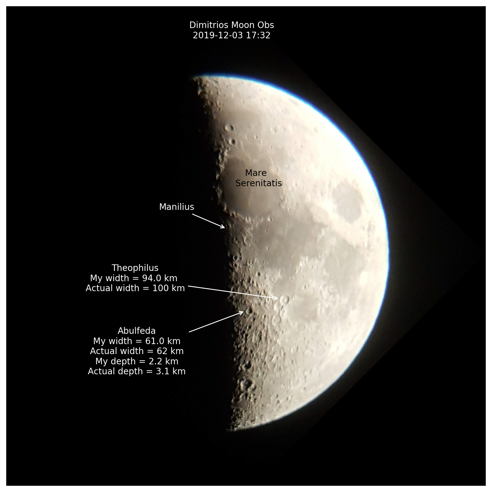
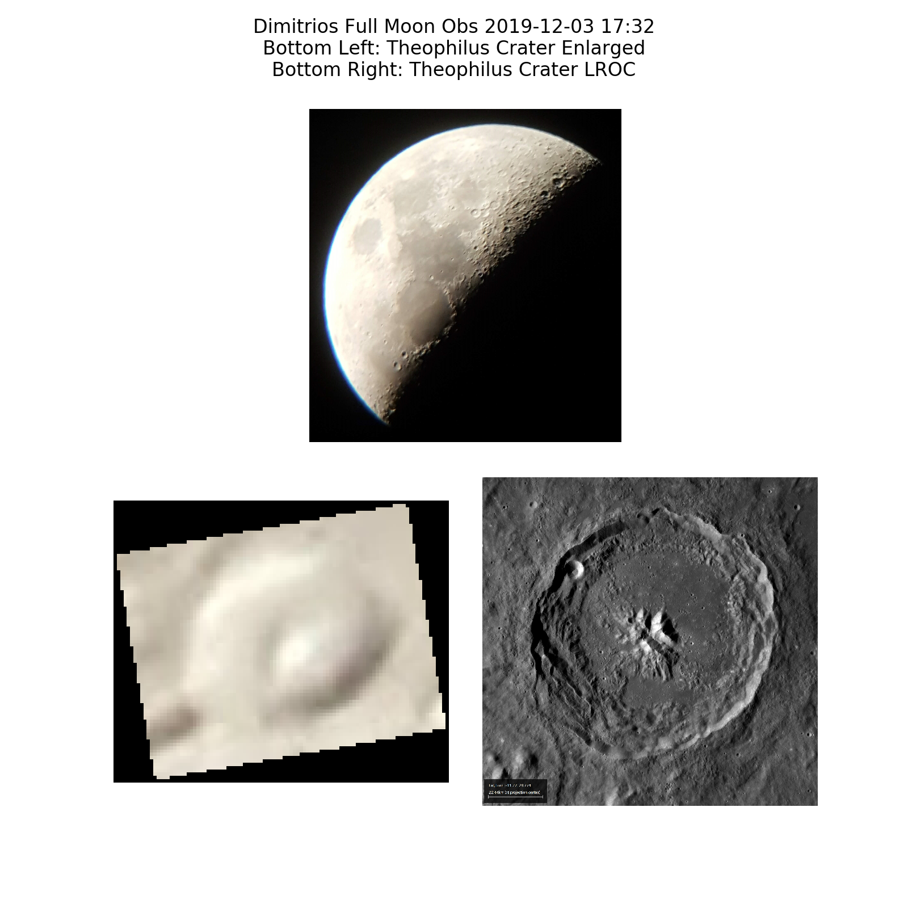
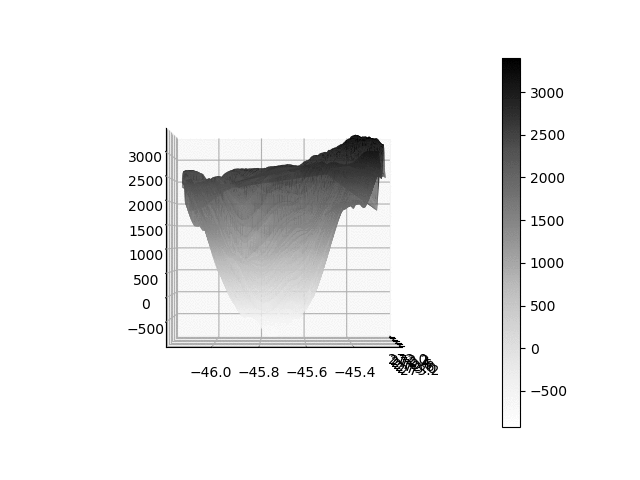

# Lunar Surface

## lunar.ipynb
## AIM - To compare our moon image to known data and work out some feature sizes

**Predict**

Have a think about these questions and make some predictions! Be sure to tell someone else what you predict.

1) Do the near and far sides of the moon look the same?    
2) What sort of surface features do you think you can find on the moon?    
3) How do we measure the height of the moon's surface?

## Intro

Annotating your image of the moon based off known data.
Calculating crater heights and depths by first calculating our telescope/camera setups resolution.
Comparing your image to Lunar Reconnaissance Orbiter (LRO) and Lunar Orbiter Laser Altimeter (LOLA) data.

**lunar.ipynb** is the main code to do the three things above.

**catalan.py** creates the gif of the Catalan crater topography using LOLA data stored in ***RDR_272E273E_46p130529S45SPointPerRow_csv_table***. Images used to make the gif outputted by this python script are in the directory ***catalan***.

Example output - annotated lunar image

Example output - crater comparison

LROC/LOLA Digital Elevation Model made using GMT

Gif of the catalan crater topography using LOLA data

## Challenge

1) Change the code we used to calculate width and depths of craters to use x,y points to calculate distance as described above  
2) Have a go at processing the included LOLA data on the Catalan crater  
3) Change the code to use the method described in the University of Exeter reference to calculate depths which doesn't rely on the small angle approximation  
4) HARD - Have a go at looking at or processing LRO/LOLA data with GMT and the PDS Geoscience Node

# References

Resolution of ccd/telescope, Astronomy Tools, https://astronomy.tools/calculators/ccd_suitability  
Depth of Craters - Univeristy of Iowa, http://astro.physics.uiowa.edu/ITU/labs/observational-labs/studying-the-moon/measure-the-height-of-lunar/  
Crater Diameters - University of Exeter, http://www.astro.ex.ac.uk/obs/experiments/lunar/script.html  

Lunar Orbital Data Explorer, PDS Geosciences Node - Washington University, https://ode.rsl.wustl.edu/moon/index.aspx    
JMARS Tool, https://jmars.mars.asu.edu/  
Lunar Reconnaissance Orbiter, http://lroc.sese.asu.edu/  
Lunar Orbiter Laser Altimeter, https://lola.gsfc.nasa.gov/

## Acknowledgements

Thanks to [Dr. John Keller](https://science.gsfc.nasa.gov/sed/bio/john.w.keller) for his guidance towards the GMT tool and processing of LOLA .IMG data files.